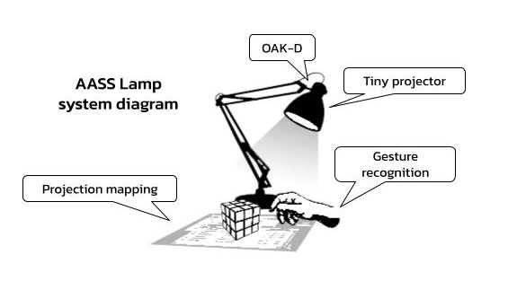
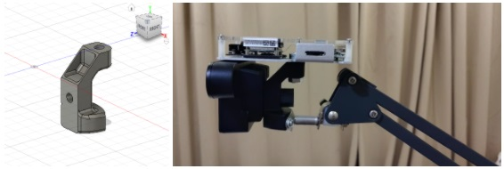
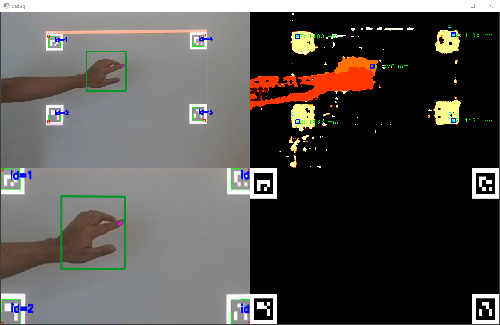
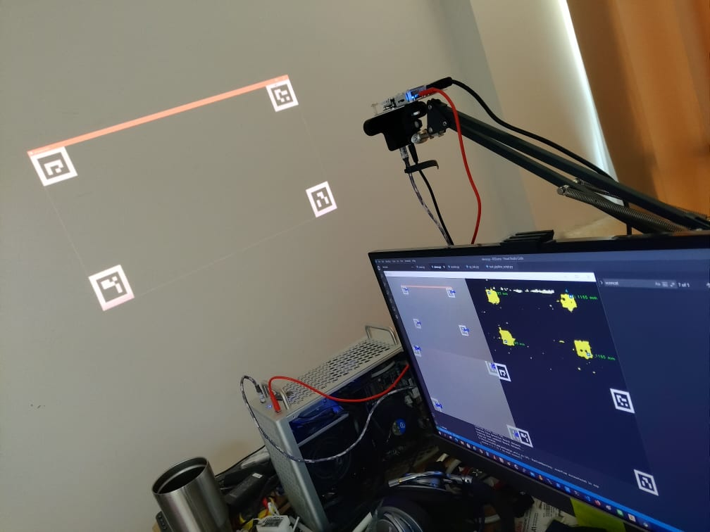
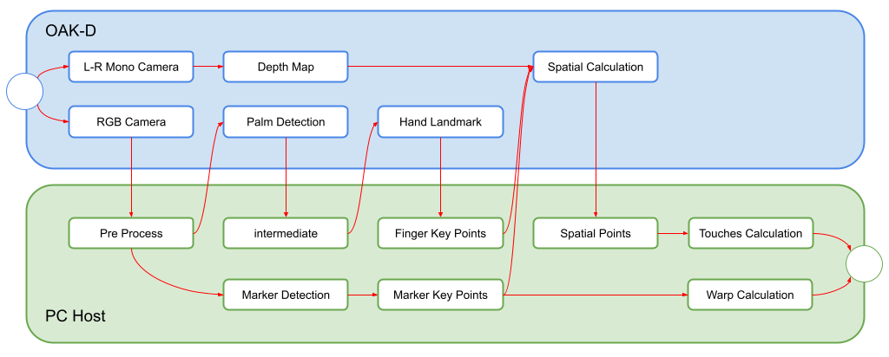

# AASS Lamp : AI Assisted Lamp

    ⚠ This version is a proof of concept, for demonstration purpose only.

AASS, AI Assisted Lamp. A new kind of table-top device with thousands of possibilities. Combine with augmented projection, deep computer vision, and machine learning technology. The system is modified from an Ikea lamp, consisting of a mini projector and [OAK-D](https://store.opencv.ai/products/oak-d) camera. Project an image of a computer graphic to any flat surface as a canvas. Enhance control with an AI hand gesture recognition with Google Mediapipe Hand Tracking models on [DepthAI](https://docs.luxonis.com/en/gen2/) stacks. Enabling any surface touch sensing with OAK-D spatial camera. As a fundamental framework, this projection lamp can be used in various ways. Not only for education but an endless possibility.



## Demo Features
* A desktop-class projection mapping system. 
* Any flat surface AI assisted multi touchs sensing.
* Spatial sensing on projected surface.
* Integrated a hand landmark detection, ready for AI hand gestures recognition.

*Note: currently, the demo is only capable of multi-touches sensing on any projected flat surface.*

## Hardware Setup
We develop a prototype by designing a custom 3D printed mounting system. Replacing an original light blob with our hardware. Holding both OAK-D and a projector in place. Then connect a desktop computer with multi-display output to the system. The primary display is used for development and debugging. The secondary display is used for a projection display for the lamp. Feeding back a projected image and real-world objects with the OAK-D camera by pointing both it and the projector in-line to the projection surface.

*A custom mounting system*  


## Install dependencies

*Inside a terminal:*
```
git clone https://github.com/GearWalker/AASSLamp_prototype.git
cd AASSLamp_prototype
pip3 install -r requirements.txt
```

## Run

*Usage:*
```
python3 ./demo.py
```

*A debug screenshot (top-left: camera input, top-right: depth,bot-left: warp img, bot-right: projected contents)*  


*A whole system setup*  


|Keypress|Function|
|-|-|
|*Esc , q*|Exit|
|*r*|Reset contents|

## Software architecture
Demonstration software is developed with the DepthAI python framework. Finding the ground truth depth of the surface from the stereo camera capturing and decode projected ArUco markers. Then, to recognize touches from a user. We using Mediapipe ’s hand landmark based on the hand_asl_recognition example. We extracted the user finger from the hand landmark then finding corresponding depth via OAK-D spatial calculator. With this scheme, we able to detect other gestures from the users.

*A software pipeline*


## Credits
* [DepthAI: an embedded spatial AI platform](https://www.luxonis.com/)
* [Google Mediapipe](https://github.com/google/mediapipe)
* Cortictechnology's [hand_asl_recognition](https://github.com/cortictechnology/hand_asl_recognition) example
